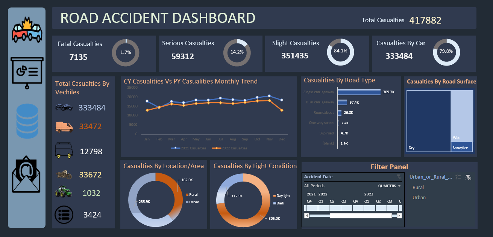

# 🚗 Road Accident Dashboard

An Excel dashboard analyzing UK road accident data to identify casualty trends, high-risk conditions, and vehicle-type involvement across 2021.

---

## 📊 Project Overview

This project dives into real-world UK road accident records, transforming raw data into a comprehensive Excel dashboard. The analysis focuses on accident severity, casualties, road conditions, vehicle types, and geographic patterns to support road safety awareness.

---

## 📁 Files Included

| File | Description |
|------|-------------|
| `Road Accident.xlsx` | Final Excel dashboard with charts and visualizations |
| `Road Accident Data Without Dashboard.xlsx` | Raw dataset and pivot tables (no dashboard) |
| Vehicle icons (`.png`) | Car, Bike, Bus, Van, Tractor, and others — used in dashboard |
| `accident.jpg` | Cover/banner image for the dashboard |

---

## 🗂️ Dataset Details

- **Source Sheet:** `Data`
- **Time Period:** 2021
- **Region:** United Kingdom

### Columns in the Dataset

| Column | Description |
|--------|-------------|
| `Accident_Index` | Unique accident identifier |
| `Accident Date` | Date of the accident |
| `Months` | Extracted month from date |
| `Year` | Extracted year from date |
| `Day_of_Week` | Day the accident occurred |
| `Junction_Control` | Type of junction control present |
| `Junction_Detail` | Junction layout (T-junction, crossroads, etc.) |
| `Accident_Severity` | Severity level (Fatal, Serious, Slight) |
| `Latitude` / `Longitude` | Geographic coordinates |
| `Light_Conditions` | Lighting at time of accident (Daylight, Darkness, etc.) |
| `Local_Authority_(District)` | District where accident occurred |
| `Carriageway_Hazards` | Any hazards on the road |
| `Number_of_Casualties` | Total casualties in the accident |
| `Number_of_Vehicles` | Vehicles involved |
| `Police_Force` | Responding police force |
| `Road_Surface_Conditions` | Dry, Wet, Icy, etc. |
| `Road_Type` | Single carriageway, Dual carriageway, One-way, etc. |
| `Speed_limit` | Posted speed limit at location |
| `Time` | Time of accident |
| `Urban_or_Rural_Area` | Urban or Rural classification |
| `Weather_Conditions` | Weather at time of accident |
| `Vehicle_Type` | Type of vehicle involved (Car, Bike, Bus, Van, etc.) |

---

## 📈 Dashboard KPIs & Insights

### Key Visuals in the Dashboard
- **Casualties by Severity** — Fatal, Serious, and Slight breakdown
- **Casualties by Vehicle Type** — Cars, Bikes, Buses, Vans, Tractors, Others
- **Monthly Trend** — Casualties over each month of 2021
- **Road Type Analysis** — Which road types see the most accidents
- **Road Surface Conditions** — Dry vs Wet vs Icy accident counts
- **Urban vs Rural Split** — Proportion of accidents by area type
- **Light Conditions** — Daylight vs Darkness accident distribution

### Notable Observations (from 2021 data)
- 🚗 **Cars** are the most frequently involved vehicle type
- 🌧️ **Wet or damp** roads contribute significantly to serious accidents
- 🌆 **Urban areas** account for a higher volume of accidents than rural
- ☀️ Many accidents occur in **daylight** conditions despite good visibility
- 📅 Accidents show **monthly variation**, with certain months spiking

---

## 🛠️ Tools Used

- **Microsoft Excel** — Pivot Tables, Pivot Charts, Slicers, Dashboard Design
- **Excel Functions** — `TEXT` (for month/year extraction)
- **Custom Icons** — Vehicle-type PNG icons embedded in the dashboard

---

## 🚀 How to Use

1. Open `Road Accident.xlsx` in Microsoft Excel (2016 or later recommended)
2. Go to the **Dashboard** sheet for the visual summary
3. Use slicers to filter by year, severity, or vehicle type
4. For raw data exploration, open `Road Accident Data Without Dashboard.xlsx`

---

## 📸 Dashboard Preview

---

## 📌 Key Learnings

- Worked with a large, multi-column real-world dataset
- Built multi-layer pivot analyses across time, geography, and condition variables
- Designed an icon-driven Excel dashboard for clear visual storytelling
- Extracted insights relevant to road safety policy and awareness

---

## 👤 Author
 Akash Kumar

---

## 📄 License

This project is for educational and portfolio purposes only. Data sourced from publicly available UK road accident records.
